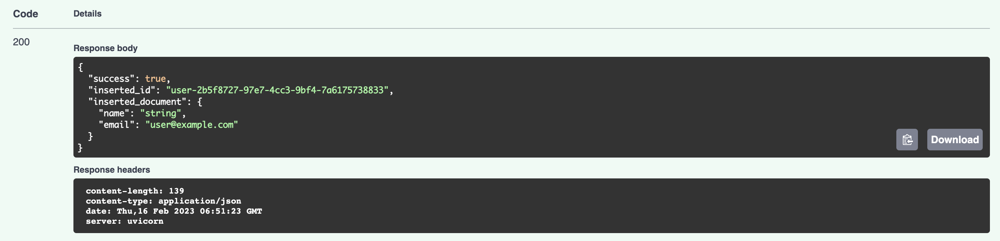

# 엔츠 스탠드얼론 개발 템플릿

### 구성요소

아래 개발 언어 및 프레임워크를 사용합니다.

- 웹(`/app`): Typescript, Node 16, Next.JS 13
- API(`/api`): Python 3.10, FastAPI 0.89
- 데이터베이스(`/mongodb`): MongoDB 6.0.1

### 실행 방법

- 시스템에 [Docker](https://docs.docker.com/engine/install/) 및 [Docker-compose](https://docs.docker.com/compose/install/)를 설치합니다.
- 환경 변수 파일(`.env`)를 생성합니다. 
```bash
cp env.template .env
```

- `JWT_SECRET_KEY`, `JWT_REFRESH_SECRET_KEY`는 사용자 세션을 관리할 때 사용되는 키입니다. 아래와 같이 키를 만들어 환경 변수에 추가합니다.
```bash
openssl rand -hex 32
```


- 6001, 6002, 6003 포트가 열려있는지 확인한 뒤, 아래의 명령어를 실행합니다.

```bash
docker-compose up -d
```

- `http://localhost:6001`: Next.JS 웹 서비스
- `http://localhost:6002`: FastAPI API 서비스
- `http://localhost:6003`: MongoDB 데이터베이스 서비스

##### 초기 실행 준비

- `http://localhost:6001`에 접속하면 backdrop 로딩 후 로그인 페이지(`/sign-in`)가 나타납니다.


- 서비스중인 회원가입 API를 직접 사용하기 위해, `http://localhost:6002/docs`에서 `POST /user`(사용자 추가)를 선택합니다.


- Try it out 버튼을 누른 뒤, `name`, `email`, `plain_password`에 이름, 이메일 및 비밀번호를 각각 입력합니다.


- Execute 버튼을 누르면 바로 아래 실행결과가 표시됩니다.



- 다시 `http://localhost:6001/sign-in` 페이지로 돌아가, 추가한 사용자의 이메일 및 비밀번호를 입력합니다.

  - 로그인 실패 시 콘솔창에 표기됩니다.


- 로그인 성공 시 화면에 sign out 버튼이 나타납니다.


### API 테스트 방법

- `http://localhost:6002/docs` 또는 `http://localhost:6002/redoc`에서 서비스중인 API 테스트가 가능합니다.

### 비고

- Macbook M1에서 작성하였습니다.
